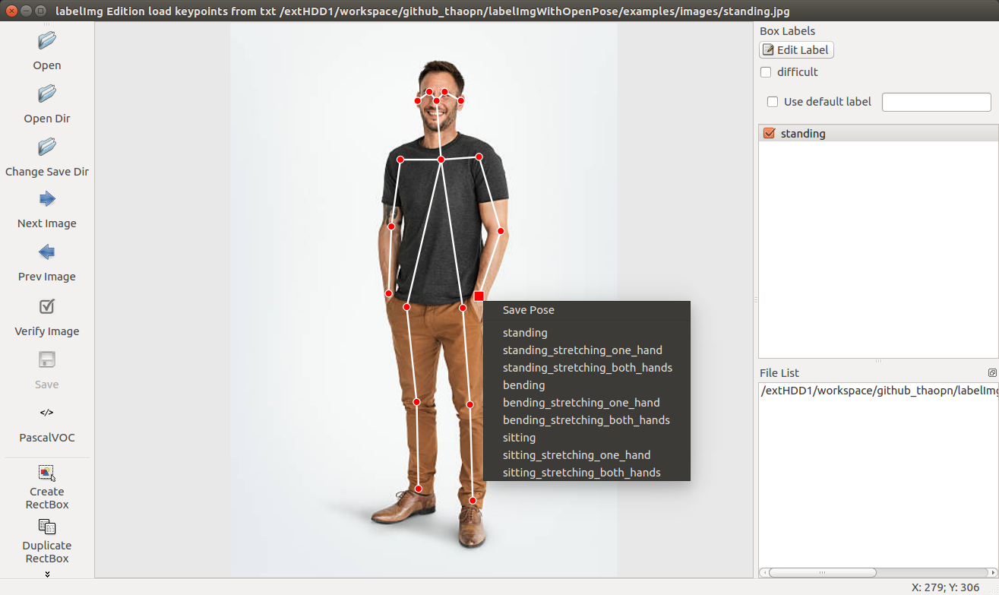

# labelImgWithOpenPose
LabelImgWithOpenPose is a graphical human pose image annotation tool development based on labelImg and OpenPose.

<p align="center">
   
</p>
<p align="center">
   
</p>

<p align="center">
   
   
</p>
Keypoints for pose above with COCO 18 body parts will save to TXT file by format 
`x1, y1, x2, y2, ...` like this:

```
228, 86, 233, 151, 188, 151, 178, 225, 175, 299, 275, 148, 299, 230, 275, 302, 195, 314, 206, 419, 208, 515, 257, 315, 265, 422, 268, 528, 220, 76, 237, 76, 207, 86, 255, 86
```

With ordering:
<p align="center">
   
   
</p>

See more here: https://github.com/CMU-Perceptual-Computing-Lab/openpose/blob/master/doc/output.md#pose-output-format-coco

## Features
- [x] Save pose skeleton to image file.
- [x] Draw pose skeleton on image to label
- [x] Extract keypoints to txt file.
- [ ] Auto annotation

## Reference:

**labelImg:** ```https://github.com/tzutalin/labelImg```

**OpenPose:** ```https://github.com/CMU-Perceptual-Computing-Lab/openpose```

## Requierment:
### OpenPose: https://github.com/CMU-Perceptual-Computing-Lab/openpose

## Installation:

### Install libs for labelImg
Python3 and Qt5
```
sudo apt-get install pyqt5-dev-tools
sudo pip3 install lxml
make qt5py3
```
See more install tutorial from labelImg ```https://github.com/tzutalin/labelImg#installation```

### Install OpenPose

Requierment a PC with GPU, reference to: [OpenPose](https://github.com/CMU-Perceptual-Computing-Lab/openpose/blob/master/doc/installation.md)

Run ```make install``` after build successfully.


## extractKeypointsWithOpenPose.py: Extract keypoints from OpenPose to txt file

### Edit some parameter
Open ```extractKeypointsWithOpenPose.py``` to edit some information.

Set GPU ID to use if you have multi GPU
```python
params["num_gpu_start"] = 0
```

Set the path to models folder of OpenPose
```python
params["default_model_folder"] = "/path/to/openpose/models/"
```

### Run with argument

```
python extractKeypointsWithOpenPose.py --imagedir=/home/ai/cuda-workspace/labelImg/examples/images/
```

Get all images in path at parameter ```--imagedir``` to pass into Openpose and save keypoints in txt file in keypoints directory with structure:
```
examples
|
---- images
|  |
|   ---- standing.jpg
---- keypoints
   |
    ---- standing.txt
```

## labelImgOpenPoseTXT.py: Review results be extracted

```
python labelImgOpenPoseTXT.py
```

Click on ```Open Dir``` button to open folder contain images, the app will automate load txt files in keypoints folder and draw that pose on images.
